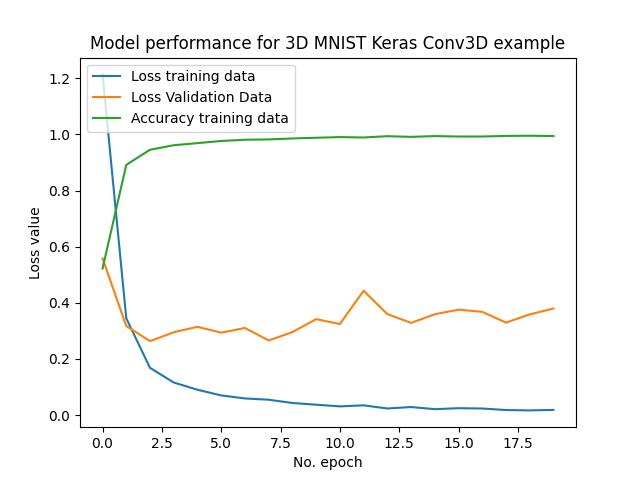

# Deep-Cnn-Img-Classifier

This is a simplified version of Very Deep Convolutional Networks for Large-Scale Image Recognition(https://keras.io/api/applications/vgg/),
with the intention of being as simple as possible to use.

A representation of the network used:

To change the number of classes (types of images), you must  changed the last layer(model.add(tf.keras.layers.Dense(N, activation='softmax'))), where N are the number of classes you have. As an example, in my implementation there are 6 types of fish.

I also used a Data Augmentation script, that modifies the original dataset to improve the results, this is especially handy if you have a small amount of images to use(less them 10k per class).

This is the result without Data augmentation:

This is the result with Data augmentation:

It was also used the following callbacks to improve the resultant Model:
EarlyStopping and ModelCheckpoint
Callback parameters can be changed to suit your needs during training.

